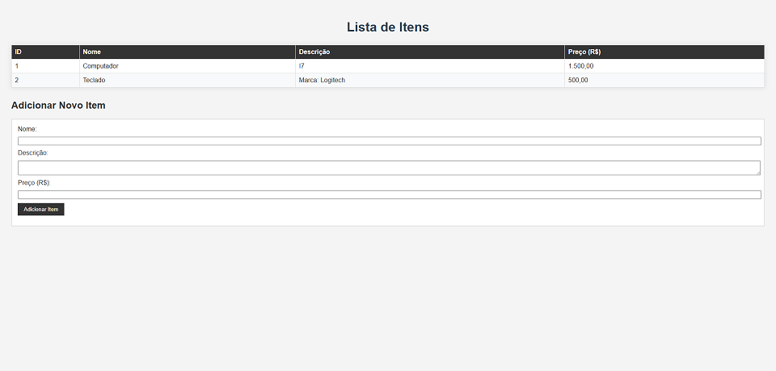

# 🛠️ Aplicação PHP com MySQL e Docker Compose

Este projeto configura um ambiente de desenvolvimento utilizando Docker Compose para rodar uma aplicação PHP com banco de dados MySQL e phpMyAdmin para gerenciamento.


---

## 🚀 Como rodar o projeto

### 1. Clone este repositório

```bash
git clone https://github.com/seu-usuario/nome-do-repositorio.git
cd nome-do-repositorio
```

### 2. Suba os containers

```bash
docker-compose up -d
```

### 3. Acesse a aplicação

* **Frontend PHP:** [http://localhost:8090](http://localhost:8090)
* **phpMyAdmin:** [http://localhost:8080](http://localhost:8080)

```plaintext
Host: db
Usuário: root
Senha: admin
```

---

## 🧰 Estrutura de diretórios

```
.
├── docker-compose.yml
├── db/                   # Volume do MySQL
└── web/                  # Código da aplicação PHP
    ├── index.php         # Listagem & Adição de itens 
    ├── style.css         # Estilos simples
```

---

## 🛠️ Criando a tabela MySQL

Após iniciar os containers, conecte-se ao phpMyAdmin ou ao terminal e execute o seguinte script SQL para criar a tabela:

```sql
CREATE DATABASE IF NOT EXISTS db;

USE db;

CREATE TABLE IF NOT EXISTS items (
    id INT AUTO_INCREMENT PRIMARY KEY,
    name VARCHAR(255) NOT NULL,
    description TEXT,
    price DECIMAL(10,2) NOT NULL
);
```

---

## 🧪 Testando a aplicação

1. Acesse [http://localhost:8090/](http://localhost:8090/)
2. Preencha o formulário com nome, descrição e preço.

---

## 🧼 Parando o projeto

Para parar e remover os containers:

```bash
docker-compose down
```

---

## 📄 Licença

Este projeto está sob a licença MIT. Sinta-se livre para usar!
